# Brand-page experience flow

What the admin sees from the moment they land on `/dashboard` through every action they can take inside a single brand. Read this when working on any of the four brand tabs (Designs / Calendar / Brand Kit / Assets) or the post detail underneath them — it's the source of truth for entry points, branches, and recovery paths.

## Entry points

Every URL that drops the user into this flow:

- `/dashboard` — admin landing, signed in, sees brand grid
- `/dashboard/brand/{brandId}` — direct deep-link to a brand's Designs tab
- `/dashboard/brand/{brandId}/calendar` — deep-link to Calendar
- `/dashboard/brand/{brandId}/kit` — deep-link to Brand Kit
- `/dashboard/brand/{brandId}/assets` — deep-link to Assets
- `/dashboard/brand/{brandId}/post/{postId}` — deep-link to a single post review
- Email CTAs from the daily client digest (`lib/digest.ts`) link to `/client/{brandId}/post/{postId}` (the *client* surface, not admin)

## Happy path

```mermaid
flowchart TD
  Start([Admin signs in]) --> Dash["/dashboard"]
  Dash -->|click brand card| Designs["/dashboard/brand/&#123;id&#125;"]
  Designs -->|click Calendar tab| Cal["/dashboard/brand/&#123;id&#125;/calendar"]
  Designs -->|click Brand Kit tab| Kit["/dashboard/brand/&#123;id&#125;/kit"]
  Designs -->|click Assets tab| Assets["/dashboard/brand/&#123;id&#125;/assets"]
  Designs -->|click post tile| Post["/dashboard/brand/&#123;id&#125;/post/&#123;postId&#125;"]
  Cal -->|click post pill| Post
  Post -->|approve| Approved[(post.status=approved)]
  Post -->|request changes| Requested[(post.status=changes_requested)]
  Post -->|regenerate| Regenerating[(image job queued)]
  Approved -->|cron: SocialPilot push| Scheduled[(SP queue: scheduled)]
  Scheduled -->|cron: SP poll| Posted[(post.status=posted)]
```

## Branches

| Branch on | Variant |
|---|---|
| Auth | Signed out → middleware redirects to `/login?next=<path>` |
| Auth | Signed in, not admin → middleware redirects to `/client/{firstBrandId}` (the client portal) |
| Brand membership | Admin → sees every brand in the grid + can open any |
| Brand membership | Client → sees only brands in `user_brand_access` (handled in `proxy.ts:86-101`) |
| Brand state | `brand_kit_json` is null → Brand Kit tab shows empty state with "run derivation" copy |
| Brand state | No logos in `brand_logos` → Assets tab shows empty state |
| Post state | No `file_path` → calendar pill renders the concept text instead of an image |
| Post state | `status === 'in_review'` → green "TO REVIEW" pill on BrandCard |
| Viewport | < 768px → header stacks vertically (title on top of tabs) |
| Viewport | ≥ 768px → header side-by-side (title absolute-left, tabs centered) |

## Error / failure states

| Failure | What the user sees | Recovery |
|---|---|---|
| Brand id not in `brands` table | `/dashboard/brand/bogus` renders 404 with "Brand not found" + back link | Click ← All brands |
| Supabase query fails (auth) | Layout throws, Next renders the error.tsx boundary | Refresh; if persistent check `SUPABASE_*` env vars |
| Supabase service role key missing | Assets tab returns 500 with `supabaseAdmin requires NEXT_PUBLIC_SUPABASE_URL and SUPABASE_SERVICE_ROLE_KEY` | Set the env var; see `dashboard/docs/observability.md` |
| `loadVideoBrandKit` 404 on `/api/render-reel` | Render API returns 404, dashboard UI surfaces the error toast | User picks a valid brand |
| Stripe webhook misconfigured | `/api/stripe/webhook` returns 400, logs `[stripe webhook] misconfigured` | Set `STRIPE_WEBHOOK_SECRET` env var |
| SocialPilot OAuth state mismatch | `/api/socialpilot/callback` returns 400 `missing_code_or_state` | Re-trigger the connect flow |
| Image API 401 | `/api/posts/{id}/image` returns 401, post tile shows the un-generated fallback | Sign in again |

## Empty / loading / success states (per tab)

- **Designs** — empty: "No posts match this filter." Loading: Next-driven streaming; the brand grid header renders first, then the post grid. Success: post grid with status badges.
- **Calendar** — empty: "Nothing on the calendar yet. Posts with a scheduled date will land here automatically." Loading: same streaming pattern; the week grid renders progressively. Success: week-grouped pills.
- **Brand Kit** — empty: "Brand kit not initialized. Run derivation from the Designs tab or via the cron to bootstrap it." Loading: panel header + skeleton sections. Success: 6 sections (Visual identity → Positioning → Voice → Content strategy → Compliance → Rules).
- **Assets** — empty: "No logos uploaded yet. Logos live in the `brand_logos` table." Loading: same streaming. Success: logo grid with default-variant indicator.

## First-run vs returning user

This flow is admin-only — there's no first-run state for admins. The first-run state for *clients* is documented in [onboarding-to-publish.md](onboarding-to-publish.md).

## Off-boarding

When a brand is deleted from `brands` (cascade to `posts`, `brand_kit_json`, `brand_logos`, `user_brand_access`):

1. Admin loses the card from `/dashboard` immediately (next request).
2. Direct links to `/dashboard/brand/{id}/...` return 404.
3. SocialPilot disconnection happens out-of-band via `/api/socialpilot/disconnect` — not auto-triggered on brand delete (open item).

## Notifications / lifecycle emails triggered by this flow

- **Daily client digest** (`lib/digest.ts` + `/api/cron/client-digest`) — sent at 13:00 UTC, includes any posts that flipped to `in_review` for brands with `client_emails`.
- **Approval confirmation** (`/api/approve/route.ts`) — sends when a client approves a post.
- **Changes-requested digest** (`/api/cron/changes-digest`) — sent at 14:00 UTC, summarizes feedback for the admin.

## Hand-offs to humans

- **Brand kit derivation** — triggered manually from the Designs tab "Run derivation" button OR by the daily cron at 15:00 UTC. Failure routes to the admin email on file.
- **SocialPilot OAuth setup** — admin clicks Connect in Brand Kit. The OAuth bounce goes to `/api/socialpilot/callback`. Failure surfaces in the UI.
- **Stripe billing portal** — Brand Kit → "Manage billing" button → `/api/stripe/portal` → Stripe-hosted UI. We hand off entirely.

## Analytics events

This flow emits no events to a third-party analytics tool today (no Segment/PostHog/Mixpanel SDK installed). Observability is currently log-based only — see [observability.md](../observability.md).

When analytics is wired up, the minimum to instrument:

- `brand_card_clicked { brand_id }`
- `tab_changed { brand_id, tab }`
- `post_approved { brand_id, post_id }`
- `post_changes_requested { brand_id, post_id }`
- `regenerate_clicked { brand_id, post_id }`

## Acceptance test for this doc

A new engineer or PM reads this and predicts:

- What the user sees if they click the Calendar tab on a brand with zero scheduled posts. *(Answer: the empty state with the "Nothing on the calendar yet" copy.)*
- What happens if a client (non-admin) tries `/dashboard/brand/blitz`. *(Answer: middleware redirects to `/client/{firstBrandId}` or `/no-access`.)*
- Which two responsive layouts the header can render. *(Answer: stacked < 768px, side-by-side ≥ 768px.)*

If the reader can't, this doc isn't done.
