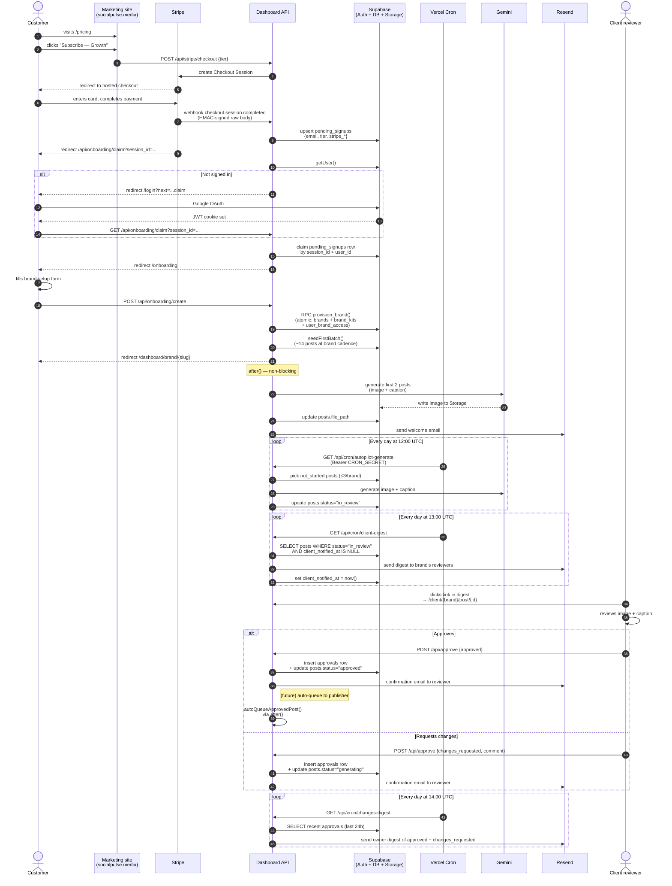

# Onboarding → Autopilot → Approval → (future) Publish

The end-to-end customer journey from a Stripe checkout to a published post. Includes happy path, branch conditions, and failure recovery paths.

## Sequence

## Branch conditions called out

| Branch | Condition | What the customer sees |
|---|---|---|
| **Stripe webhook delayed** | Customer redirects to `/api/onboarding/claim` before the webhook has upserted `pending_signups` | Page polls every 2s and shows "Stripe's confirmation is still processing." Form is still fillable; the link happens when the webhook lands. |
| **Existing brand owned by this user** | `/onboarding` finds an existing `user_brand_access` row for the signed-in user | Redirect to `/dashboard/brand/{slug}` — the onboarding form is a one-shot wizard, not re-runnable. |
| **Slug already taken** | The `provision_brand` RPC's existence check inside the transaction finds a duplicate `brands.id` | 409 returned with a friendly message: `"The slug \"{slug}\" is already taken. Pick a different one."` |
| **Gemini generation fails** | The `after()`-wrapped autopilot call throws | Posts stay `status="not_started"`; the daily cron will retry. Welcome email still sends. |
| **No reviewers configured for the brand** | `client-digest` cron finds posts but `getBrandClientEmails()` is empty | Skipped with `status="skipped:no_recipients"`. Operator sees in logs. |
| **Past-date post auto-queued** | `autoQueueApprovedPost` sees a date ≤ now() | Returns `skipped: "past_date"`, writes `queue_status="failed"` + reason. Operator publishes manually. |
| **SocialPilot refresh-token dead** | `getValidAccessToken()` throws `SocialPilotAuthError` | `socialpilot_credentials.last_error` populated. UI shows "Reconnect SocialPilot" banner. Auto-queue marks the post `failed`; retry cron picks it up. (Currently dormant — SP integration parked.) |

## Recovery paths

| Error | Recovery |
|---|---|
| Stripe webhook signature mismatch | 400 returned. Stripe retries with exponential backoff (won't retry past 3 days). Operator gets alert via Vercel cron failure visibility. |
| Provision RPC fails mid-transaction | Postgres rolls back automatically — no partial brand state. User sees error, can retry the onboarding form. |
| Gemini outage during cron | Cron marks each failing post `generation_failed` with error message. Next cron tick retries. After 5 failures the post stays manual until operator investigates. |
| Resend rate limit | Email send returns failure; logged. Digest cron is idempotent on `client_notified_at` — next day's tick re-attempts the un-notified posts. |
| Approval comes in during regeneration | Approval row inserted normally. Post status flips to `approved` even though regeneration was in flight — the in-flight gen completes but its result is dropped. (Edge case; rare in practice.) |
| Customer cancels Stripe sub | Webhook `customer.subscription.deleted` fires → `brands.subscription_status="canceled"`. Autopilot gate (not yet implemented) would block further generation for that brand. |

## Hand-offs to humans

- **Operator manual publishing**: until Postiz/SocialPilot integration ships, "publish" is a human step. The reviewer approves; operator opens the post detail page; copies caption; downloads image; posts to Instagram by hand.
- **Refund / billing disputes**: operator handles via Stripe Dashboard. Customer Portal (link in dashboard's billing block) covers self-service cancellation but not refund issuance.
- **Support escalation**: no formal queue. Customer emails the operator directly. (Future: a `support_requests` table tied to brand_id.)

## Analytics events emitted

Currently none — the app doesn't have a frontend analytics pipeline yet. The DB itself is the source of truth for funnel reporting:
- Sign-ups → `auth.users` row count
- Active subs → `brands` WHERE `subscription_status = 'active'`
- Posts generated → `posts` WHERE `file_path IS NOT NULL`
- Posts approved → `approvals` WHERE `status = 'approved'`
- Time-to-first-approval → `MIN(approvals.created_at) - brands.created_at`
