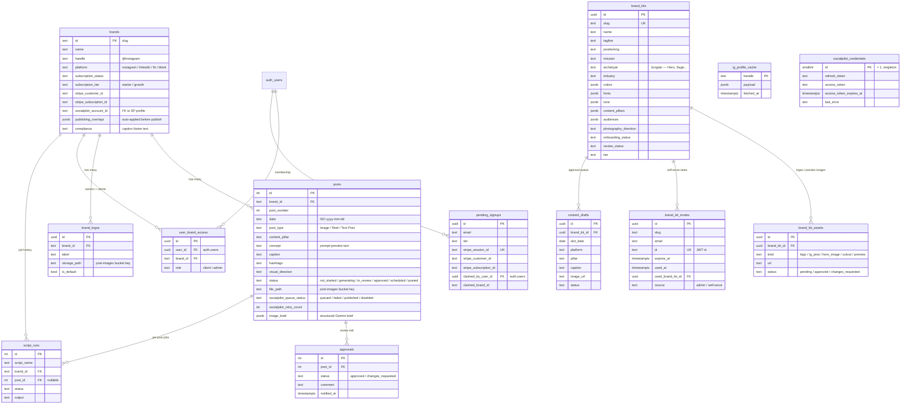

# Database schema

Generated from the live Supabase project (`oqzkwsqrxpqntlojsvzz`). 13 tables in `public`. All RLS-enabled. See each table's purpose below the diagram.

## ER diagram

## Table reference

### `brands`
The public-facing identity. `id` is a slug (`iec`, `omega`, `csc`). One row per active customer brand. Holds subscription state (Stripe customer, tier, period end), SocialPilot binding, and publishing-overlay rules. 8 rows currently.

### `posts`
Every scheduled or generated post. FK to `brands`. Generated by autopilot cron from a seeded calendar at onboarding. Caption + image_brief + file_path get populated by the Gemini pipeline. SocialPilot fields track auto-queue state. 87 rows currently.

### `approvals`
Append-only log of client decisions on a post. `status` is `approved` or `changes_requested`. `comment` holds the client's note. Drives the change-request loop back into `generating`.

### `user_brand_access`
Cross-table that grants a Supabase Auth user (`auth.users`) access to a brand with a role. Created during onboarding's atomic `provision_brand` RPC.

### `brand_logos`
One brand can have many logo variants (`4C`, `1C`, white-on-dark, etc.). `is_default` picks the hero logo. `storage_path` is the post-images bucket key. `local_path` is the dev-only filesystem path used by Python overlay scripts.

### `script_runs`
Job history for shell scripts (logo overlay, footer overlay, hyperframes render). `output` holds stdout/stderr. Used by the dashboard to show "last ran" status.

### `brand_kits`
Separate from `brands` — this is the **derived** kit (positioning, mission, archetype, palette, pillars). Populated either by manual onboarding form or by the `derive-kit` autopilot reading approved posts over time.

### `brand_kit_assets`
Per-kit assets: logos, IG post samples, hero images, cutouts. Used by `derive-kit` for visual inference. Each has its own review status.

### `brand_kit_invites`
JWT-signed invite tokens for self-serve onboarding (separate from the Stripe-driven funnel via `pending_signups`).

### `content_drafts`
Older draft queue table — being superseded by `posts`. Retained for legacy compatibility but new flows write to `posts`.

### `pending_signups`
Staging table between Stripe checkout (no user_id yet) and first sign-in. Webhook upserts here on `checkout.session.completed`; the user's first dashboard visit claims the row and copies tier + customer_id onto the new brand row.

### `ig_profile_cache`
Cache for Instagram profile data fetched during onboarding / kit derivation. Keyed by handle.

### `socialpilot_credentials`
Singleton row (id=1) holding the agency SocialPilot OAuth refresh + access tokens. **Dormant** — Postiz / direct SocialPilot integration is currently parked.
